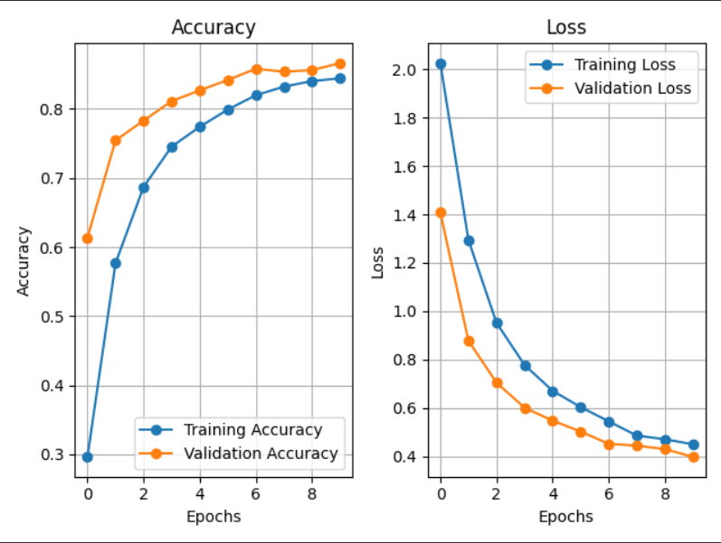

# 💊 Pharmaceutical Drugs & Vitamins Classification: Enhanced Transfer Learning Model


## 📖 Executive Summary

This project focuses on solving **low accuracy and underfitting problems** commonly observed in basic transfer learning approaches applied to pharmaceutical image classification.

The baseline approach (VGG16 with frozen layers) failed to exceed the **60% accuracy threshold**, mainly due to the visual similarity between pills, tablets, and vitamin packages. By redesigning the pipeline with a **ResNet50 backbone**, **advanced data augmentation**, and **mixed precision training**, the final model achieved **~87%+ validation accuracy** with stable convergence and strong generalization.

---

## 📊 Dataset

The project uses the following public Kaggle dataset:

🔗 **Pharmaceutical Drugs and Vitamins (Synthetic Images)**
[https://www.kaggle.com/datasets/vencerlanz09/pharmaceutical-drugs-and-vitamins-synthetic-images](https://www.kaggle.com/datasets/vencerlanz09/pharmaceutical-drugs-and-vitamins-synthetic-images)

The dataset contains synthetic but highly diverse images of:

* Pharmaceutical drugs
* Vitamin pills
* Different packaging styles
* Various orientations, scales, and lighting conditions

This diversity makes the dataset ideal for evaluating transfer learning robustness.

---

## 📉 The Problem: Structural Limitations

Initial experiments revealed that the baseline model lacked sufficient learnable capacity for this domain.

### Baseline Model Analysis

* **Architecture:** VGG16 (ImageNet weights, frozen convolutional layers)
* **Critical Limitation:** Acted only as a static feature extractor
* **Training Duration:** Limited epochs
* **Data Handling:** No augmentation
* **Performance:** ~60% accuracy with unstable loss behavior

### Visual Evidence


*Figure 1: Baseline training metrics showing low accuracy and volatile loss, indicating underfitting.*

---

## 🛠️ The Solution: Deep Engineering

Rather than increasing epochs blindly, targeted architectural and data-centric improvements were applied.

### 1️⃣ Architectural Upgrade (VGG16 ➡️ ResNet50)

The model was upgraded to **ResNet50**, enabling deeper feature learning through residual connections.

Key design choices:

* **Pretrained ImageNet weights**
* **Global Average Pooling** to reduce parameters
* **Custom Dense Layers** (256 units, ReLU)
* **Dropout** for regularization

---

### 2️⃣ Advanced Data Augmentation

To simulate real-world variations and prevent memorization, a strong augmentation pipeline was introduced:

```python
train_generator = ImageDataGenerator(
    rotation_range=20,
    width_shift_range=0.2,
    height_shift_range=0.2,
    shear_range=0.2,
    zoom_range=0.2,
    horizontal_flip=True
)
```

This helped the model learn orientation-invariant and scale-invariant features.

---

### 3️⃣ Optimization & Training Strategy

* **Mixed Precision Training (`mixed_float16`)** for faster GPU computation and lower memory usage
* **Callbacks Used:**

  * `EarlyStopping` (monitoring validation accuracy)
  * `ReduceLROnPlateau` (adaptive learning rate scheduling)

---

## 📊 Results

The applied improvements resulted in a significant performance boost.

| Metric              | Baseline (VGG16)  | Final Model (ResNet50)   | Impact     |
| ------------------- | ----------------- | ------------------------ | ---------- |
| Metric              | Baseline (VGG16)  | Final Model (ResNet50)   | Impact     |
| ------              | ----------------- | ------------------------ | --------   |
| Training Accuracy   | 0.5661            | 0.8442                   | 🚀 +27.8%  |
| Validation Accuracy | 0.6019            | 0.8662                   | 🚀 +26.4%  |
| Training Loss       | 1.3289            | 0.4491                   | ✅ Improved |
| Validation Loss     | 1.9539            | 0.3968                   | ✅ Stable   |
| Learning Rate       | 1e-4              | 1e-4                     | ⚙️ Tuned   |

---

## 📈 Final Performance Analysis



*Figure 2: Final training curves showing stable convergence and minimal overfitting.*

---

## 🧪 Dataset Samples


*Figure 3: Sample images from the pharmaceutical drugs and vitamins dataset.*

---

## 🛠️ Running the Project

```bash
git clone https://github.com/HimmetDemir45/transfer-learning.git
cd transfer-learning
pip install tensorflow pandas numpy matplotlib scikit-learn
python transferLearning.py
```

---

## 👨‍💻 Author

**Himmet**
GitHub: [https://github.com/HimmetDemir45](https://github.com/HimmetDemir45)

This project is open-source and developed for **educational and research purposes**.
